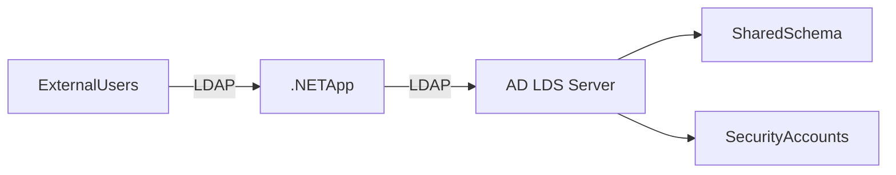

# ProprietarySystemsProject
#Project Planning:
Here's a comprehensive `README.md` file that consolidates all the guidance from our chat into a structured format for your AD LDS project:

---

# **Active Directory LDS (AD LDS) Project**  
*A lightweight directory service with external user access via .NET LDAP application*

---

## **Table of Contents**  
1. [Project Architecture](#project-architecture)  
2. [Prerequisites](#prerequisites)  
3. [Setup & Configuration](#setup--configuration)  
   - [Part 1: Install AD LDS](#part-1-install-ad-lds)  
   - [Part 2: Develop .NET Application](#part-2-develop-net-application)  
4. [GUI Options](#gui-options)  
   - [WinForms](#winforms-recommended)  
   - [WPF](#wpf)  
   - [ASP.NET Core](#aspnet-core)  
5. [Code Implementation](#code-implementation)  
   - [LDAP Connection](#ldap-connection)  
   - [CRUD Operations](#crud-operations)  
6. [Security Best Practices](#security-best-practices)  
7. [Testing & Validation](#testing--validation)  
8. [Troubleshooting](#troubleshooting)  

---

## **Project Architecture**  


---

## **Prerequisites**  
### **Software**  
- **Windows Server 2022** (for AD LDS)  
- **Visual Studio 2022** (for .NET development)  
- **.NET Framework 4.8** or **.NET 6+**  

### **Roles/Features to Install**  
1. **AD LDS Role**:  
   ```powershell
   Install-WindowsFeature -Name "ADLDS" -IncludeManagementTools
   ```  
2. **.NET Development Pack** (via Visual Studio Installer).  

---

## **Setup & Configuration**  

### **Part 1: Install AD LDS**  
1. **Run Setup Wizard**:  
   - Open Server Manager → Add Roles → Select **Active Directory Lightweight Directory Services**.  
2. **Create Instance**:  
   - Unique instance name (e.g., `MyADLDSInstance`).  
   - Ports: `389` (LDAP) / `636` (LDAPS).  
   - Partition: `CN=MyPartition,DC=mycompany,DC=com`.  
3. **Configure Schema**:  
   - Use **ADSI Edit** to create OUs (`Users`, `Groups`).  
   - Add test users and assign permissions.  

### **Part 2: Develop .NET Application**  
#### **GUI Options**  
| Framework      | Use Case                          | Pros                              |  
|---------------|----------------------------------|----------------------------------|  
| **WinForms**  | Simple admin tools               | Fast development, native UI       |  
| **WPF**       | Modern desktop apps              | Scalable, data-binding support    |  
| **ASP.NET**   | Web access for external users    | Cross-platform, no client install |  

**Recommendation**: Start with **WinForms** for quick testing.  

---

## **Code Implementation**  

### **LDAP Connection**  
```csharp
using System.DirectoryServices.Protocols;

var connection = new LdapConnection(
    new LdapDirectoryIdentifier("adlds-server:389"));
connection.Credential = new NetworkCredential("admin", "password");
connection.AuthType = AuthType.Basic;
```

### **CRUD Operations**  
#### **1. Create (Add) User**  
```csharp
var addRequest = new AddRequest(
    "CN=NewUser,OU=Users,DC=mycompany,DC=com",
    new DirectoryAttribute[] {
        new DirectoryAttribute("objectClass", "user"),
        new DirectoryAttribute("cn", "NewUser")
    });
connection.SendRequest(addRequest);
```

#### **2. Search Users**  
```csharp
var searchRequest = new SearchRequest(
    "OU=Users,DC=mycompany,DC=com",
    "(objectClass=user)",
    SearchScope.Subtree);
var response = (SearchResponse)connection.SendRequest(searchRequest);
```

#### **3. Update User**  
```csharp
var modifyRequest = new ModifyRequest(
    "CN=ExistingUser,OU=Users,DC=mycompany,DC=com",
    DirectoryAttributeOperation.Replace,
    "description",
    "Updated description");
connection.SendRequest(modifyRequest);
```

#### **4. Delete User**  
```csharp
var deleteRequest = new DeleteRequest("CN=OldUser,OU=Users,DC=mycompany,DC=com");
connection.SendRequest(deleteRequest);
```

---

## **Security Best Practices**  
1. **Use LDAPS** (port 636) in production.  
2. **Secure Credentials**:  
   ```csharp
   var securePassword = new SecureString();
   foreach (char c in "password") securePassword.AppendChar(c);
   connection.Credential = new NetworkCredential("user", securePassword);
   ```  
3. **Limit Permissions**: Restrict external users to read-only access where possible.  

---

## **Testing & Validation**  
1. **Verify CRUD Operations**:  
   - Check ADSI Edit for created/modified entries.  
2. **Test External Access**:  
   - Run the .NET app from a non-domain machine.  
3. **Logs**: Monitor `Event Viewer → AD LDS` for errors.  

---

## **Troubleshooting**  
| Issue                          | Solution                          |  
|-------------------------------|----------------------------------|  
| **Connection refused**        | Check firewall rules for ports 389/636. |  
| **Invalid credentials**       | Verify username format (`cn=user,ou=users,dc=mycompany,dc=com`). |  
| **Schema errors**             | Ensure object classes (e.g., `user`) are defined in schema. |  

---

## **Next Steps**  
1. [ ] Deploy AD LDS instance.  
2. [ ] Implement WinForms/WPF UI.  
3. [ ] Test CRUD operations.  
4. [ ] Document schema and user guides.  

--- 

**Attachments**:  
- [Sample WinForms Project](https://example.com/sample-code) (placeholder link)  
- [AD LDS Schema Reference](https://learn.microsoft.com/en-us/windows-server/identity/ad-ds/get-started/virtual-dc/active-directory-domain-services-overview)  

--- 

This `README.md` provides a complete roadmap for your project. Customize the placeholders (e.g., server names, OUs) as needed!
